# Virtual Store

  

  

### TERCERA ENTREGA 3️⃣

  

  

### Desafio - Ecoomerce Backend

  

  

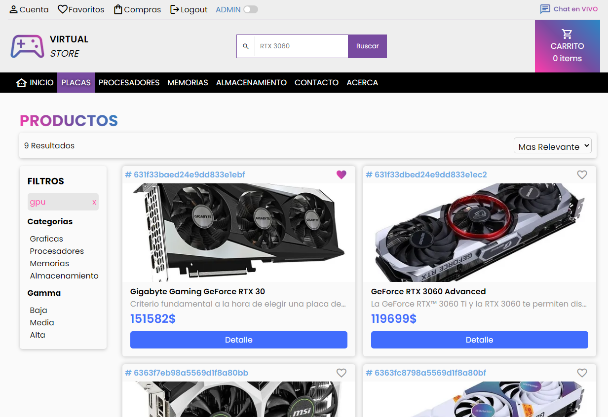

  

  

  

Repositorio con el proyecto de ecommerce, realizado para la carrera FullStack de CoderHouse

  

  

  

## Table de contenidos ✨

  

  

  

- [Vision General](#vision-general-📑)

  

  

- [Funcionamiento](#funcionamiento-⚙)

  

  

- [Desafio](#desafio-🏅)

  

  

- [Estructura](#estructura-🧷)

  

  

- [Links](#links-🔗)

  

  

  

- [Proceso](#proceso-🔨)

  

  

  

- [Proyecto](#proyecto-🌍)

  

  

  

- [Que aprendi](#que-aprendi-💡)

  

  

  

- [Recursos utiles](#recursos-utiles-🔔)

  

  

  

- [Autor](#autor-😎)

  

  

  

## Vision General 📑

  
Este **proyecto** significa, todo lo aprendido, no solo en el modulo de Backend, si no tambien todo lo recorrido en la carrera de **FullStack**, demostrando todo lo el conocimiento adquirido tanto en diseño como en logica de programación.
Se presenta como **resultado**, un sistema de dos partes, FrontEnd y BackEnd, con la propuesta de ser un sistema de **ecommerce**, el cual ofrece la venta de harware de computadoras.
  

### Funcionamiento ⚙

  

  

Para correr el Sistema debemos instalar los modulos en caso de no contar con ellos, los toma todos desde el package.json

  

```
npm install
```

  

una vez que tenemos todas las dependencias solo quedar correr el servidor, ubicados en la carpeta "/server"

  

```
npm start
o
node server.js
```

  

recibiremos el mensaje

  

```
Servidor escuchando en el PUERTO:8080 - PID WORKER:XXXX
```

  

  

-> dentro del archivo .env, podemos cambiar de modo **FORK** a **CLUSTER**

  

  

que nos indica que todo esta correcto, para ingresar al sistema solicitamos en el navegador

  

```
http://localhost:8080/
```

  

  

### Desafio 🏅

  

  

  

El Usuario debería ser capaz de:

  

  

  

- Ver el diseño de manera optioma en ambas pantallas, escritorio y mobil.

  

  

  

- Ver todos los movimientos interactivos sobre los botones

  

  

### Estructura 🧷

  

  

```bash
Client -> Proyecto completo en React

Server -> Servidor Node + Build Front End
```

  

  

### Links 🔗

  

  

  

**RAILWAY**

  

  

- URL del Sitio en Vivo: [Demo en HEROKU](https://virtualstore-production.up.railway.app/) 👀

  

  

  

## Proceso 🔨

  

  

  

### Proyecto 🌍

  

  

## Etapa 4

  

**Consigna 1 - 📣**

  

Contendrá las rutas necesarias que permitan listar los productos existentes, ingresar productos nuevos, borrar y modificar sus detalles, así como interactuar con el carrito de compras.

  

Se implementará una API RESTful con los verbos get, post, put y delete para cumplir con todas las acciones necesarias.

  

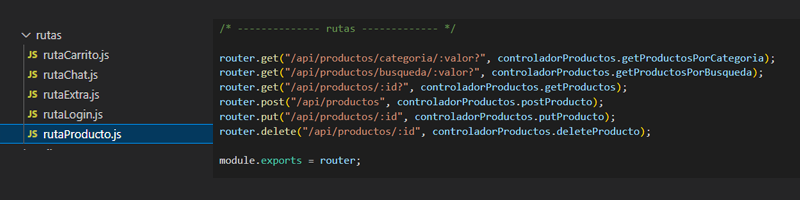

**Consigna 2 - 📣**

  

Debe brindar al frontend un mecanismo de ingreso autorizado al sistema basado en JWT (Json Web Token).

  

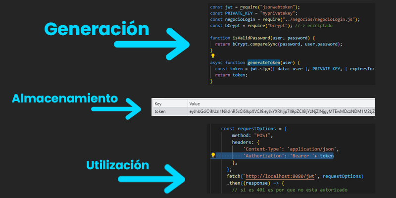

  
  

**Consigna 3 - 📣**

Los productos ingresados se almacenarán en una base de datos MongoDB.

  

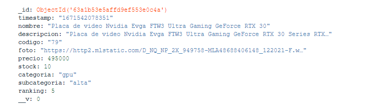

  
  

**Consigna 4 - 📣**

  

El usuario podrá registrar sus credenciales de acceso (email y password) para luego poder ingresar a su cuenta. Estas credenciales serán guardadas en la base de datos MongoDB encriptando la contraseña.

  

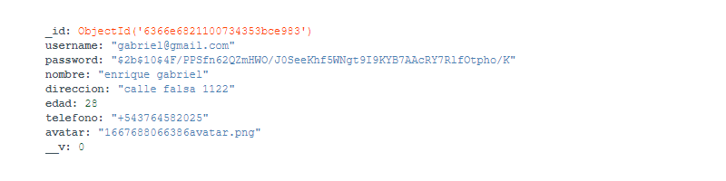

  

**Consigna 5 - 📣**


El cliente tendrá una sesión activa de usuario con tiempo de expiración configurable.


 
 configuración dentro del archivo .ENV

**Consigna 6 - 📣**

Implementarás un canal de chat basado en websockets, el cual permita atender las consultas del cliente.

  
⭐ Vamos a contar con un canal de chat general donde el usuario enviará los mensajes en la ruta **/chat**

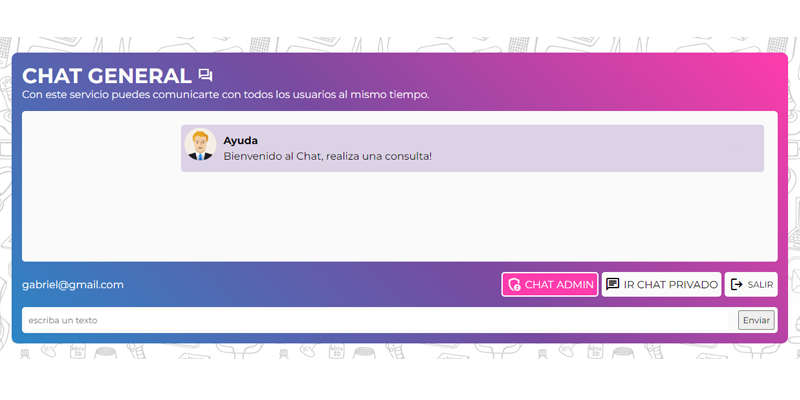

y en **/chat/:email** podrá ver sólo los suyos.

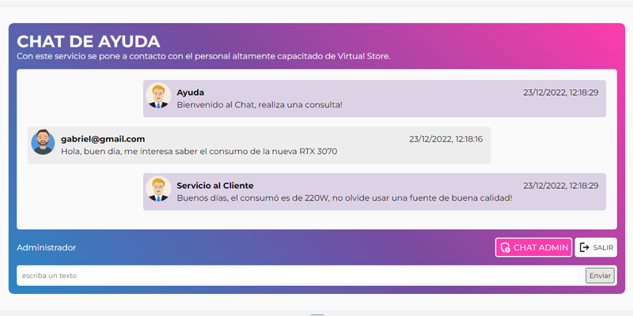

Se utilizará la colección **mensajes** en MongoDB. La tecnología de comunicación a utilizar será Websockets. El servidor implementará una vista, utilizando handlebars, para visualizar todos los mensajes y poder responder individualmente a ellos, eligiendo el email de respuesta

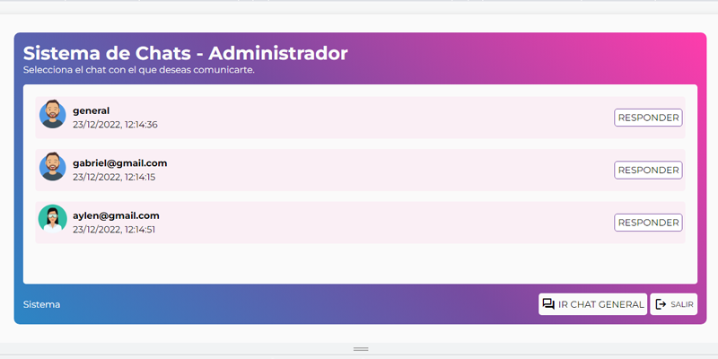

Vistas realizadas con HBS.

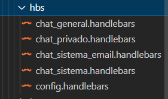

  

**Consigna 7 - 📣**

 
La arquitectura del servidor estará basada en capas (MVC)

  

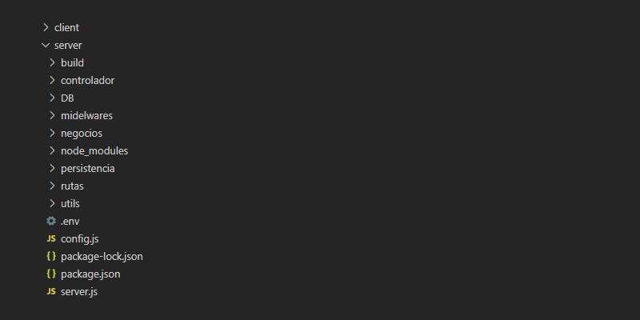

  

**Consigna 8 - 📣**

El servidor podrá tomar configuraciones desde un archivo externo.
  

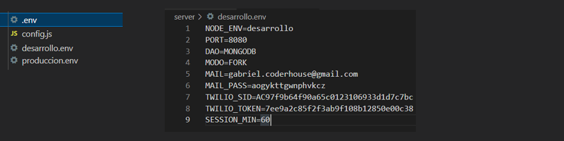

  

**Consigna 9 - 📣**

Dispondrá de una vista creada con pug, que permita ver la configuración del servidor.

- Ruta del archivo config PUG RAILWAY: [config pug](https://virtualstore-production.up.railway.app/config) 👀
- Ruta del archivo config PUG LOCAL: [config pug](https://localhost:8080/config) 👀

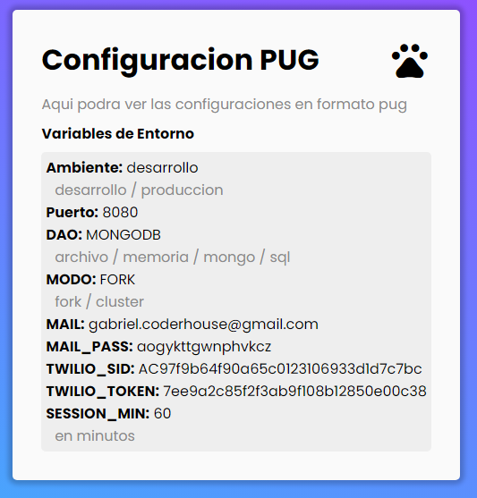

  

**Consigna 10 - 📣**

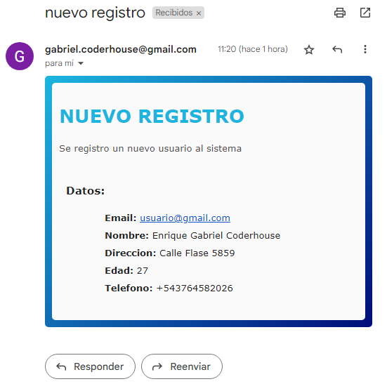

Se enviará un mail a una casilla configurable, por cada registro nuevo de usuario y con cada orden de compra generada.

  
**Consigna 11 - 📣**


En caso de detectar algún error, el servidor enviará una vista implementada con ejs, que contenga el id y el detalle completo

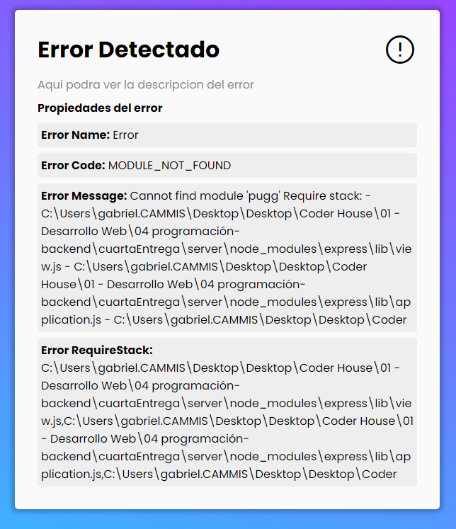 
  

**REQUISITOS BASE**

  

**Requisito 1 - ⭐**

  

Permitir un menú de ingreso al sistema con email y password así como también la posibilidad de registro de un nuevo usuario.

  

El menú de registro consta del nombre completo del cliente, número telefónico, email y campo de password duplicado para verificar coincidencia.

  

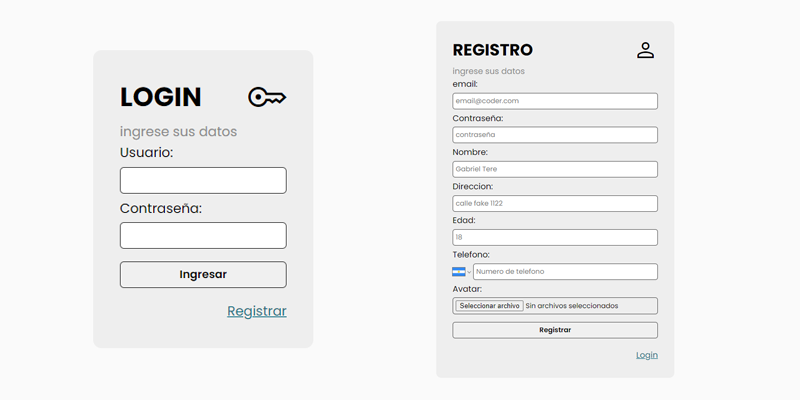

  

**Requisito 2 - ⭐**
 

La ruta **/productos** devolverá el listado de todos los productos disponibles para la compra

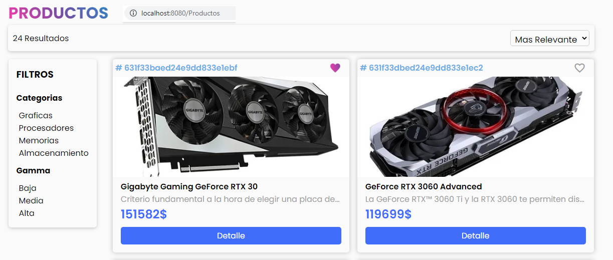


La ruta **/productos/:categoria** devolverá los productos por la categoría requerida.

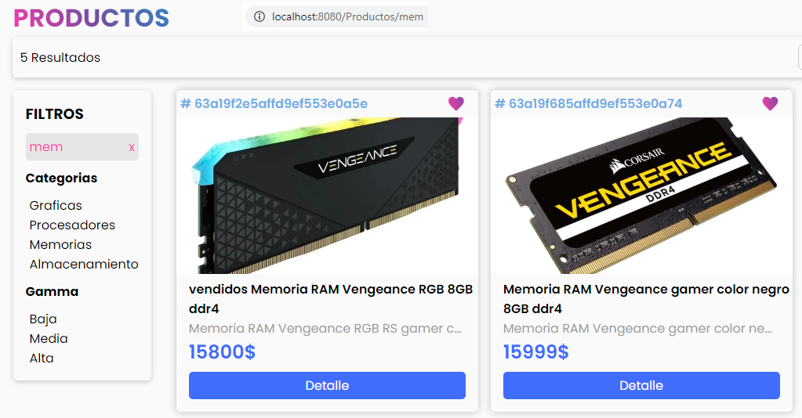

Los ítems podrán ser agregados al carrito de compras y listados a través de la ruta **/carrito**.
Se podrán modificar y borrar por su id a través de la ruta **/carrito:id**.

  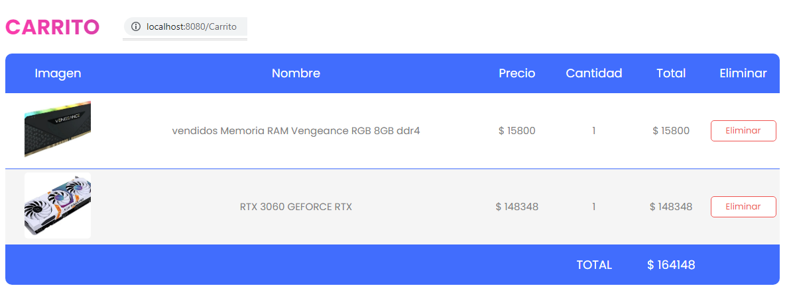

 

Se puede solicitar un producto específico con la ruta **/productos/:id**, donde **id** es el id del item generado por MongoDB y devolver la descripción del producto ( foto, precio, selector de cantidad).

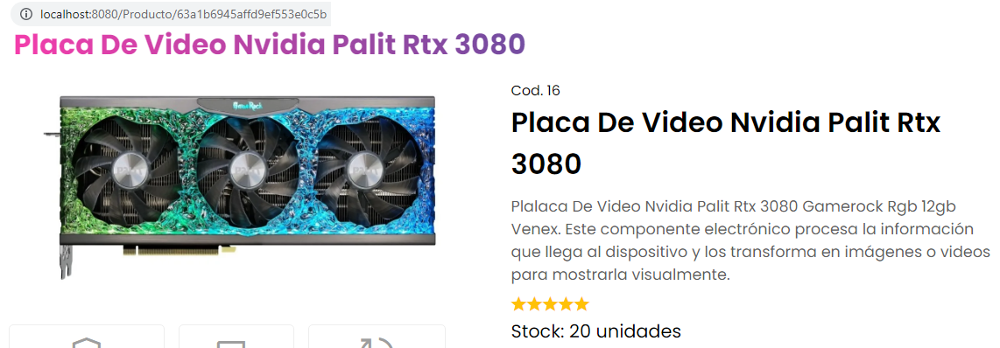

Si se ingresa a **/productos/:id** y el producto no existe en MongoDB, debemos responder un mensaje adecuado que indique algo relacionado a que el producto no existe.

 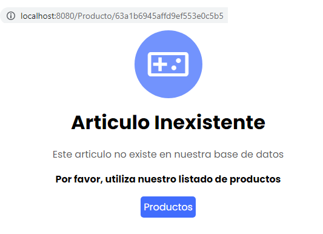

**Requisito 3 - ⭐**

Implementar al menos estas colecciones:


► **usuarios:** clientes registrados

► **productos:** catálogo completo

► **mensajes:** chat del usuario (preguntas y respuestas)

► **carrito:** orden temporal de compra

► **ordenes:** las órdenes generadas, que deben incluir los productos, descripciones y los precios **al momento de la compra.**

  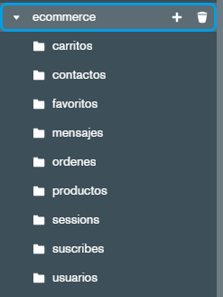

**Requisito 4 - ⭐**

Finalizada la orden, enviar un mail a la dirección de mi cuenta con los detalles de la orden.

 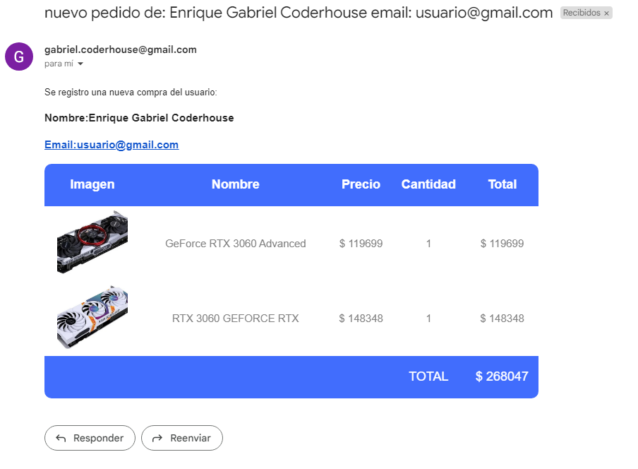

Se dispondrá de un archivo de configuración externo con opciones para desarrollo y otras para producción, que serán visualizadas a través de una vista construida con handlebars. Como parámetros de configuración estará el puerto de escucha del servidor, la url de la base de datos, el mail que recibirá notificaciones del backend, tiempo de expiración de sesión y los que sea necesario incluir.

- Ruta del archivo config HBS RAILWAY: [config pug](https://virtualstore-production.up.railway.app/hbs) 👀
- Ruta del archivo config HBS LOCAL: [config pug](https://localhost:8080/hbs) 👀

  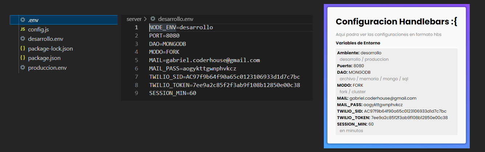


**Funcionalidades extras agregadas por el alumno** 🦾


♪ **Pagina de Inicio**

 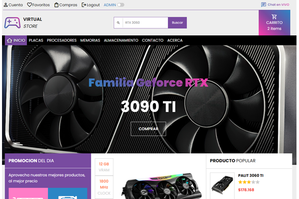

♪ **Seccion de favoritos**

  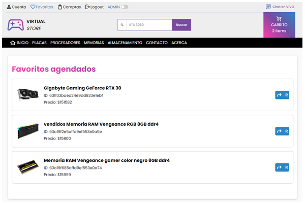
  
♪ **Compras realizadas o ordenes**

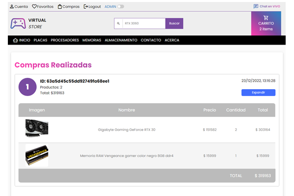

♪ **Formulario de contacto, con ruta, y colección propia.**

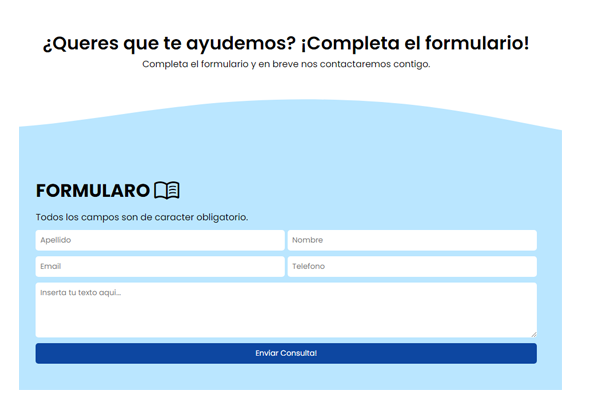

♪ **Formulario de newsletter, con rutas y colección en la base de datos.**

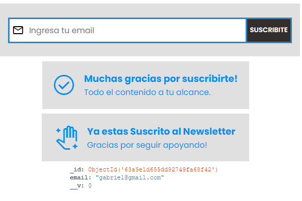

♪ **Distintos tipos de filtros**

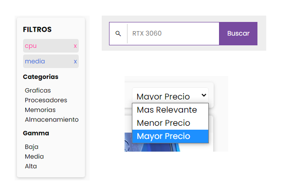

♪ **Pagina de Acerca, con rutas y hash anchors**

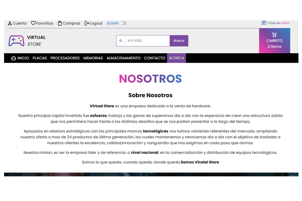

♪ **Testeo automático de todas las rutas y funcionamiento del servidor**

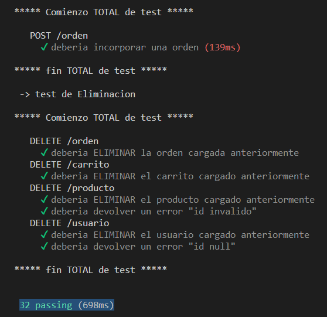

### Que aprendí 💡

Luego de haber finalizado todo el modulo completo de Backend, me quedaron claros muchos conceptos, 
- Como renderizar del lado del servidor
- Como confeccionar una API REST 
- Metodologia de trabajo en capas
- Manejo de dependencias
- Manejo de errores
- Control de Logeos
- Test Manuales y Test Automatizados
- Manejo de Frameworks
- Herramientas de consultas para base de datos
- Manejo del objeto process

Aunque queda mucho por **aprender**, el curso abarco una amplia cantidad de contenidos que hay que seguir utilizando y practicando.
Lo mas importante es la capacidad de **autoaprendizaje** y **solución** de problemas utilizando las herramientas que nos provee la documentación 

### Recursos Útiles 🔔

  

- [w3schools](https://www.w3schools.com/css/) - Esta pagina es esencial para aprender lo básico de HTML, CSS y JS.

  

  

- [Mdn Mozilla developer Network](https://developer.mozilla.org/es/docs/Web/CSS/CSS_Grid_Layout) - MDN es el sitio de documentacion STANDART.

  

- [Node v.16 ](https://nodejs.org/dist/latest-v18.x/docs/api/) - Entorno de desarrollo

  

- [React v.18](https://es.reactjs.org/docs/getting-started.html) - Entorno de FrontEnd

  

- [Express Js v4.18](https://expressjs.com/es/starter/installing.html) - Ruteo de peticiones

  

- [MonogoDB v.6](https://www.mongodb.com/docs/) - Base de datos NO relacional

 - [bcrypt 5.1](https://www.npmjs.com/package/bcrypt) - Libreria para encriptar las contraseñas

- [chai 4.3.7](https://www.npmjs.com/package/chai) - Libreria de asserts, para la comparacion de respuestas.
- [connect-mongo 4.6](https://www.npmjs.com/package/connect-mongo) - Libreria para la conexion de mongo con las sessiones.
- [cors 2.8.5](https://www.npmjs.com/package/cors) - Libreria para manejo de conexiones seguras en express, con fuentes externas.
- [dotenv 16.0.1](https://www.npmjs.com/package/dotenv) - Libreria para el manejo de archivos .env.
- [ejs 3.1.8](https://www.npmjs.com/package/ejs) - Libreria necesaria para renderizar archivos .ejs.
- [express-handlebars 6.0](https://www.npmjs.com/package/express-handlebars) - Libreria necesaria para renderizar archivos .handlebars.
- [express-session 1.17.3](https://www.npmjs.com/package/express-session) - Modulo para registrar sessiones.
- [jsonwebtoken 8.5](https://www.npmjs.com/package/jsonwebtoken) - Libreria escencial para creacion de tokens jw.
- [knex 2.3](https://www.npmjs.com/package/knex) - Libreria multidialecto para conecciones de base de datos.
- [mongoose 6.6](https://www.npmjs.com/package/mongoose) - Libreria de modelado de objetos.
- [multer 1.4](https://www.npmjs.com/package/multer) - midelware de express para subir archivos al servidor.
- [nodemailer 6.8](https://www.npmjs.com/package/nodemailer) - Libreria para envio de emails para node.
- [passport 0.6](https://www.npmjs.com/package/passport) - Midelware de autorizacion para express.
- [passport-jwt 4.0](https://www.npmjs.com/package/passport-jwt) - Estrategia para el uso de jsonwebtoken.
- [passport-local 1.0](https://www.npmjs.com/package/passport-local) - Estrategia de autenticacion con username y password.
- [pug 3.0](https://www.npmjs.com/package/pug) - Libreria necesaria para renderizar archivos .pug.
- [socket.io 4.5](https://www.npmjs.com/package/socket.io) - Libreria necesaria la comunicacion bidireccional.
- [supertest 6.3](https://www.npmjs.com/package/supertest) - abstraccion para conecciones http.
- [twilio 3.83](https://www.npmjs.com/package/twilio) - Librería necesaria para utilizar los servicios de twilio en node.
- [winston 3.8](https://www.npmjs.com/package/winston) - Libreria sencilla de logger.


  

  

## Autor 😎

  

  

  

- Linkedin - [in/gabriel-teresczuk](https://www.linkedin.com/in/gabriel-teresczuk/)